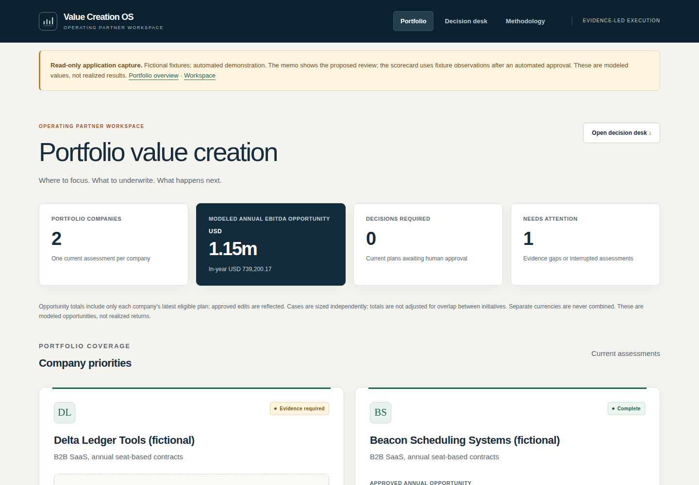
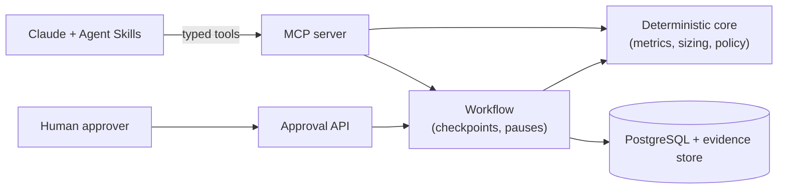

# PE Portfolio Value Creation Operating System

Turns portfolio-company operating data into evidence-backed value-creation initiatives, deterministically sized EBITDA cases, a human-approved 100-day plan, and ongoing KPI monitoring.

**Built for PE operating partners and portfolio-company executives, with technical diligence available throughout.** Assess modeled EBITDA, prioritize workstreams, inspect assumptions and evidence, record a human decision, and monitor the approved plan. Open the [portfolio site](https://ahines99.github.io/pe-value-creation-os/), [case study](docs/portfolio/case-study.md), [walkthrough](docs/portfolio/quickstart.md) or [actual synthetic output](docs/portfolio/demo-report.md).



**Showcase status:** the executive workspace is implemented and tested. Explore portfolio priorities, investment memos, workstream contributions, source evidence and operating scorecards. Financial assumptions and audit details remain available within each workflow.

**Progress review package:** start with the [current case study](docs/portfolio/case-study.md),
[10-minute demonstration](docs/portfolio/progress-demo.md), [practitioner challenge packet](docs/portfolio/practitioner-review.md)
and [requirement-by-requirement acceptance record](docs/portfolio/progress-acceptance.md).
The constructed case becomes adverse when operating evidence changes. The latest
memo reopens the first-wave preference and preserves original, close, accounting
and exit-review history. No company sponsor, actual intervention or realized result is claimed.

The financial/lifecycle implementation through [PR #32](https://github.com/ahines99/pe-value-creation-os/pull/32)
passed all ten [CI jobs](https://github.com/ahines99/pe-value-creation-os/actions/runs/36493440351):
1,047 tests per supported Python version, 39 evaluations and 54 browser checks.
Those results are bound to that implementation; the acceptance record gives exact hashes and limits.
[Historical v0.1.0 release evidence](docs/releases/0.1.0/evidence.md) and the
[delegated showcase closeout](docs/portfolio/showcase-closeout.md) remain available.
The [capability roadmap](docs/operating-partner-roadmap.md) retains open lifecycle,
commercial-review and pilot work. Production acceptance remains separate.

**Real-data research lane:** the [public-company pilot workflow](docs/pilot/public-company-research.md) reads authorized local Compustat caches and builds a private executive research memo with peer comparisons, source reconciliation and a diligence agenda. This is separate from the fictional operating showcase. Licensed data stays outside the public site; independent analyst acceptance and operational impact remain unvalidated.

**Executive decision packet:** [Read the Progress memo](https://ahines99.github.io/pe-value-creation-os/portfolio/decision-memo.html)
for the public thesis, accounting review, competing capacity-tested first waves,
adverse case, historical company equity bridge and next evidence request. Public facts and constructed operating
scenarios remain separate; no company approval or realized result is claimed.

**Public filing baseline (work in progress):** [Progress Software's historical
financial baseline](https://ahines99.github.io/pe-value-creation-os/portfolio/progress-baseline.html)
replays from 241 issuer-sourced annual/interim facts without vendor credentials.
It now adds a reconciled revenue-mix extraction, acquisition contribution bridge
and sourced investigate/defer/reject research assessments; organic growth remains
unavailable where the disclosures do not establish it. A metric-specific peer exhibit
shows reported margin context, exclusions and deliberately withheld strict medians.
It separates quarterly and YTD periods, derives quarterly cash with source lineage,
and flags the September 2026 acquisition as outside the historical financial
perimeter. Earnings/cash definitions and unresolved accounting differences remain
visible. The full company
thesis and permissioned pilot remain in implementation;
see the [case charter](docs/pilot/progress-case-charter.md) and
[prepared pilot package](docs/pilot/permissioned/README.md).

**Monthly economics (constructed exercise):** the [underwriting exhibits](https://ahines99.github.io/pe-value-creation-os/portfolio/underwriting.html)
separate 24-month EBITDA, pre-tax cash, funding need and incremental EV sensitivity.
They retain adverse scenarios, collection reversals and committed costs after scope
exclusions. [Replay instructions and source boundaries](data/constructed/progress/README.md)
make clear that these are assumed operating records, not actual Progress results.
The [100-day operating proposal](https://ahines99.github.io/pe-value-creation-os/portfolio/operating-plan.html)
now sequences dependencies against explicit weekly resource budgets and recalculates
the same financial model. Capacity conflicts delay benefits while original costs
remain. Assignments and acceptance gates are proposed and constructed; durable
case revisions and exact-version research reviews are now stored separately from
operating approvals. The [case-history walkthrough](https://ahines99.github.io/pe-value-creation-os/portfolio/case-history.html)
preserves original/current forecasts and labels its two service-authored reviews
as simulated. The [constructed realization review](https://ahines99.github.io/pe-value-creation-os/portfolio/realization.html)
adds three monthly accounting comparisons, explicit claims, unassigned residuals
and preserved source corrections. The [execution review](https://ahines99.github.io/pe-value-creation-os/portfolio/execution.html)
adds simulated assignments, completion/acceptance receipts, steering holds and
claim links that lose support when evidence is withdrawn. Actual human review,
observed company results and validated causal attribution remain unperformed.

## Try it

Requires [uv](https://docs.astral.sh/uv/) and Python 3.12+.

```bash
uv sync --extra dev
uv run pvc demo          # five scenarios on fictional companies; writes var/demo-report.md
```

The demo runs in process, with no database or API key. It shows:

1. **Success path.** Beacon (a pricing leak) produces sized opportunities and a 100-day plan, then pauses for approval.
2. **Human approval.** An unauthenticated approval attempt gets HTTP 401. An approver token approves, the worker resumes the run, and KPIs activate.
3. **Controlled pause.** Delta (broken data) stops at `needs_evidence` with named gaps. Planted prompt-injection text is recorded as a `suspicious_content` finding, not followed.
4. **Branch failure the run survives.** Cedar's pricing diagnostic fails, and the other branches still produce a plan.
5. **Clean failure and resume.** Value modeling fails once, the run stops at `failed`, and `pvc resume` finishes it without redoing completed steps.

For the actual browser review workspace, start Docker Desktop and run `python scripts/showcase.py up`. Open `http://localhost:18081/` and enter the generated local token. The [walkthrough](docs/portfolio/quickstart.md) covers review, evidence, decisions, KPIs and shutdown. All companies are fictional; reported value cases are modeled opportunities.

Licensed under [Apache-2.0](LICENSE). See [contributing](CONTRIBUTING.md) and [security reporting](SECURITY.md).

## Develop

Commands that start services or read company data run in production mode unless `PVC_ENV=dev` is set, and then
refuse to start without an identity provider. For local work, export it once:

```bash
export PVC_ENV=dev                            # PowerShell: $env:PVC_ENV = "dev"
uv run pytest -q                              # unit, contract, MCP, API, workflow and regression tests
uv run pvc eval --suite all --gate            # 29 golden + 10 adversarial cases, gated at 100%
uv run ruff check . && uv run ruff format --check . && uv run mypy
uv run python -m pe_value_os.skills_lint     # skills reference only tools that exist
```

PostgreSQL tests (row-level security, repository contract, migrations, warehouse adapter) run when `PVC_TEST_DATABASE_URL` points at a PostgreSQL 18 server (the version CI and docker compose use) where the test user can create databases. Otherwise they are skipped. `docker compose up db` starts one.

Run the services locally (with `PVC_ENV=dev` exported as above):

```bash
docker compose up                                    # PostgreSQL, migrations, MCP server, approval API, worker
uv run uvicorn pe_value_os.mcp_server:app --port 8000   # MCP over Streamable HTTP (dev principal: PVC_ALLOWED_COMPANIES)
uv run uvicorn pe_value_os.api.app:app --port 8080      # approval API and review UI (dev tokens: PVC_DEV_TOKENS)
uv run pvc mcp-stdio                                 # MCP over stdio, used by the Claude Code plugin (.mcp.json)
```

In dev, the approval API accepts the opaque tokens defined in `PVC_DEV_TOKENS`; `.env.example` shows an approver
token. Outside dev, every service verifies OAuth tokens from the identity provider: MCP clients need `pvc.read`
(and `pvc.write` for tools that change state), and approval decisions need `pvc.approve` on a token issued to the
approval UI client for the API's own audience. `.env.example` lists every setting.

Operator commands: `pvc run`, `resume`, `status`, `worker`, `kpi`, `recompute`, `offboard`, `access-review`, `audit-export`. Run `uv run pvc --help` for details.

## How it works



| Layer | Owns |
|---|---|
| Deterministic core | All arithmetic, metric definitions, sufficiency rules, value-case sizing |
| MCP server | 22 typed tools, resources and prompts; company scope checked on every call |
| Agent Skills (`skills/`) | Domain procedure: diagnostic trees, checklists, output contracts |
| Workflow + PostgreSQL | Run state, checkpoints, approvals, audit trail, row-level security |
| Model layer (optional) | Opportunity proposals and plan narrative. Numeric prose uses server-issued quantity references that bind metric, units, company, period and evidence. |

The model supplies judgment: which levers to investigate, scenario assumptions, narrative. The system supplies facts and arithmetic. The default proposer is rule-based. Set `PVC_PROPOSER=model` with `ANTHROPIC_API_KEY` to use Claude at the judgment steps. See [docs/architecture.md](docs/architecture.md) for the full diagram and the run state machine.

## Why this is not just a chatbot

- The LLM never does financial arithmetic. Sizing and metrics are versioned, tested code, and a guardrail rejects unbound numeric prose; `get_numeric_sources` supplies references for supported facts.
- The LLM is not the system of record. Runs, evidence, findings and approvals live in PostgreSQL, and every step is checkpointed and audited.
- Every value claim must resolve to stored, immutable evidence, or the run pauses with `NEEDS_EVIDENCE`.
- Company scope is enforced twice: by the token's company claims on every tool call, and by row-level security in the database.
- Material actions stop at a human approval gate. No model-callable tool can approve, and approval decisions need a token issued to the approval UI with its own audience and `pvc.approve` scope, so an MCP client's token cannot be replayed to approve.
- Failures are controlled. A broken branch becomes a recorded gap, a failed step can be resumed, and an unavailable model pauses the run instead of guessing.

## Status

| Area | State |
|---|---|
| Domain, MCP, workflow, approvals, KPIs, adapters, evals, observability, ops tooling | Implemented; audit fixes and regression evidence are tracked in [audit remediation](docs/audit-remediation.md). Local tests do not establish production acceptance. |
| Public Progress case and constructed lifecycle | Six case revisions, source-constrained memo, dated capacity plan, accounting/claim residuals and separate exit sensitivity. [Current acceptance and open requirements](docs/portfolio/progress-acceptance.md); no independent practitioner review or actual pilot. |
| CI (GitHub Actions) | Exact PR #32 evidence: ten successful jobs, 1,047 tests per Python version, 39 evaluations and 54 browser checks. Later changes require their own successful CI. HIGH and CRITICAL image findings fail regardless of fix availability. |
| Terraform (AWS), CD pipeline | Configuration and offline validation exist; no AWS apply or deployed acceptance evidence. |
| Live-model evaluation | Historical September 23 proposer-only subset; narrator was not exercised. Its $2.03 estimate excludes complete cache accounting and is not an invoice. Current proposer/narrator gates require a new authorized live run ([record](docs/evals/2026-09-23-live-model.md)). |
| Sign-offs and operations | Pending a human MCP skill session, domain review of skills/policy/eval bands, threat-model review, external pen test, legal/retention review, SLO acceptance and staffed on-call. |
| Merge protection | The public candidate acceptance record documents all ten required checks with administrator enforcement. CD separately verifies the exact deployment SHA; a new release still needs its own successful evidence. |
| Pilot and launch | Staging acceptance, pilot, conditional production provisioning, production validation, then launch approval. See [pilot documentation](docs/pilot/). |

[ROADMAP.md](ROADMAP.md) has the per-ticket status. The [portfolio finalization roadmap](docs/portfolio-finalization-roadmap.md) prioritizes a polished showcase, assigns implementation and owner actions, and preserves the later production acceptance path.

## Repository map

| Path | Contents |
|---|---|
| [IMPLEMENTATION_HANDOFF.md](IMPLEMENTATION_HANDOFF.md) | Specification: contracts, data model, tool catalog, current state |
| [ROADMAP.md](ROADMAP.md) | Ticketed milestones, release gates, per-ticket status |
| [src/pe_value_os/](src/pe_value_os/) | Application: `domain/`, `tools/`, `workflows/`, `adapters/`, `llm/`, `api/`, `db/` |
| [skills/](skills/) | Six Agent Skills with scripted MCP replay examples (human acceptance pending) |
| [tests/](tests/) | Tests, synthetic fixture companies, snapshots |
| [evals/](evals/) | Golden and adversarial suites and gate thresholds |
| [docs/](docs/) | Architecture, ADRs, data contracts, threat model, SLOs, runbooks, deployment, pilot |
| [infra/](infra/), [Dockerfile](Dockerfile) | Container image and AWS Terraform |
| [ops/observability/](ops/observability/) | Grafana dashboard, Prometheus alerts, OpenTelemetry collector |
| [.claude-plugin/](.claude-plugin/) | Claude Code plugin packaging for the skills and MCP server |

Operating company records and outcomes in the demonstration are synthetic. The
separate public Progress diligence case cites published issuer financial facts.


The [constructed operating-source challenge](https://ahines99.github.io/pe-value-creation-os/portfolio/operating-sources.html)
shows how contract notice windows, bounded terms, vendor commitments and disputed
invoices can overturn an initially positive forecast. It reuses the financial
engine and retains original costs; it represents no actual company records or
realized savings. [Method and replay](docs/adr/0021-operating-source-schedules.md).

The [integrated case review](https://ahines99.github.io/pe-value-creation-os/portfolio/source-review.html)
persists that challenge and a vendor-evidence correction as immutable revisions,
with structured lessons and simulated exact-version reviews. It preserves the
frozen close and constructed accounting/attribution history. The
[pilot sponsor package](docs/pilot/permissioned/README.md) is prepared; no sponsor
or actual operating pilot is in place.

The [disclosure history](https://ahines99.github.io/pe-value-creation-os/portfolio/disclosure-history.html)
preserves the preliminary and final ShareFile acquisition allocations from two
public filings. Its 18 source rows reconcile independently. Publication-time
selection remains withheld where timestamp evidence is missing; the issuer
revision is a measurement-period adjustment, not an accounting-error restatement.
The [sponsor brief](docs/pilot/permissioned/sponsor-brief.md) and
[kickoff worksheet](docs/pilot/permissioned/kickoff-worksheet.md) are ready for a
prospective pilot discussion; no company pilot has started.

The [constructed exit review](https://ahines99.github.io/pe-value-creation-os/portfolio/exit-review.html)
adds a sixth saved revision, an earnings/multiple/interaction decomposition and
a hypothetical equity bridge. Scoped operating forecasts remain separate from
company-level sensitivities. Actual proceeds, distributions and investment
returns remain unavailable.
