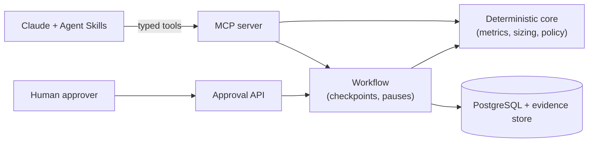

# PE Portfolio Value Creation Operating System

Turns portfolio-company operating data into evidence-backed value-creation initiatives, deterministically sized EBITDA cases, a human-approved 100-day plan, and ongoing KPI monitoring.

**Status: feature-complete and verified locally; not yet deployed.** Everything in [ROADMAP.md](ROADMAP.md) that can be built and tested without cloud access or outside reviewers is done. The remaining tickets need an AWS account, named people (a domain expert, a security reviewer, legal, an on-call rotation), or a pilot portfolio company. See [Status](#status).

## Try it

Requires [uv](https://docs.astral.sh/uv/) and Python 3.12+.

```bash
uv sync --extra dev
uv run pvc demo          # five scenarios on fictional companies; writes var/demo-report.md
```

The demo runs in process, with no database or API key. It shows:

1. **Success path.** Beacon (a pricing leak) produces sized opportunities and a 100-day plan, then pauses for approval.
2. **Human approval.** An unauthenticated approval attempt gets HTTP 401. An approver token approves, the worker resumes the run, and KPIs activate.
3. **Controlled pause.** Delta (broken data) stops at `needs_evidence` with named gaps. Planted prompt-injection text is recorded as a `suspicious_content` finding, not followed.
4. **Branch failure the run survives.** Cedar's pricing diagnostic fails, and the other branches still produce a plan.
5. **Clean failure and resume.** Value modeling fails once, the run stops at `failed`, and `pvc resume` finishes it without redoing completed steps.

## Develop

```bash
uv run pytest -q                              # unit, contract, MCP, API and workflow tests
uv run pvc eval --suite all --gate            # 29 golden + 9 adversarial cases, gated at 100%
uv run ruff check . && uv run ruff format --check . && uv run mypy
uv run python -m pe_value_os.skills_lint     # skills reference only tools that exist
```

PostgreSQL tests (row-level security, repository contract, migrations, warehouse adapter) run when `PVC_TEST_DATABASE_URL` points at a PostgreSQL 18 server (the version CI and docker compose use) where the test user can create databases. Otherwise they are skipped. `docker compose up db` starts one.

Run the services locally:

```bash
docker compose up                                    # PostgreSQL, migrations, MCP server, approval API, worker
uv run uvicorn pe_value_os.mcp_server:app --port 8000   # MCP over Streamable HTTP (dev auth)
uv run uvicorn pe_value_os.api.app:app --port 8080      # approval API and review UI
uv run pvc mcp-stdio                                 # MCP over stdio, used by the Claude Code plugin (.mcp.json)
```

Operator commands: `pvc run`, `resume`, `status`, `worker`, `kpi`, `recompute`, `offboard`, `access-review`, `audit-export`. Run `uv run pvc --help` for details.

## How it works



| Layer | Owns |
|---|---|
| Deterministic core | All arithmetic, metric definitions, sufficiency rules, value-case sizing |
| MCP server | 21 typed tools, resources and prompts; company scope checked on every call |
| Agent Skills (`skills/`) | Domain procedure: diagnostic trees, checklists, output contracts |
| Workflow + PostgreSQL | Run state, checkpoints, approvals, audit trail, row-level security |
| Model layer (optional) | Opportunity proposals and plan narrative. It is guarded so it cannot introduce numbers. |

The model supplies judgment: which levers to investigate, scenario assumptions, narrative. The system supplies facts and arithmetic. The default proposer is rule-based. Set `PVC_PROPOSER=model` with `ANTHROPIC_API_KEY` to use Claude at the judgment steps. See [docs/architecture.md](docs/architecture.md) for the full diagram and the run state machine.

## Why this is not just a chatbot

- The LLM never does financial arithmetic. Sizing and metrics are versioned, tested code, and a guardrail rejects model text that contains numbers not produced by a tool.
- The LLM is not the system of record. Runs, evidence, findings and approvals live in PostgreSQL, and every step is checkpointed and audited.
- Every value claim must resolve to stored, immutable evidence, or the run pauses with `NEEDS_EVIDENCE`.
- Company scope is enforced twice: by the token's company claims on every tool call, and by row-level security in the database.
- Material actions stop at a human approval gate. No model-callable tool can approve.
- Failures are controlled. A broken branch becomes a recorded gap, a failed step can be resumed, and an unavailable model pauses the run instead of guessing.

## Status

| Area | State |
|---|---|
| Domain, MCP, workflow, approvals, KPIs, adapters, evals, observability, ops tooling | Built and tested locally |
| Container image, Terraform (AWS), CD pipeline | Written and statically validated (`terraform validate`, `terraform test`, actionlint). Not yet built in CI or applied. |
| Live-model evaluation | Harness is ready. It needs an API key to run (`pvc eval --proposer model`). |
| Sign-offs and operations | Pending named people: domain expert (skills), threat-model review, external pen test, legal, on-call rotation |
| Pilot and GA | Pending a pilot portfolio company. See [docs/pilot/](docs/pilot/). |

[ROADMAP.md](ROADMAP.md) has the per-ticket status.

## Repository map

| Path | Contents |
|---|---|
| [IMPLEMENTATION_HANDOFF.md](IMPLEMENTATION_HANDOFF.md) | Specification: contracts, data model, tool catalog, current state |
| [ROADMAP.md](ROADMAP.md) | Ticketed milestones, release gates, per-ticket status |
| [src/pe_value_os/](src/pe_value_os/) | Application: `domain/`, `tools/`, `workflows/`, `adapters/`, `llm/`, `api/`, `db/` |
| [skills/](skills/) | Six Agent Skills with generated worked examples |
| [tests/](tests/) | Tests, synthetic fixture companies, snapshots |
| [evals/](evals/) | Golden and adversarial suites and gate thresholds |
| [docs/](docs/) | Architecture, ADRs, data contracts, threat model, SLOs, runbooks, deployment, pilot |
| [infra/](infra/), [Dockerfile](Dockerfile) | Container image and AWS Terraform |
| [ops/observability/](ops/observability/) | Grafana dashboard, Prometheus alerts, OpenTelemetry collector |
| [.claude-plugin/](.claude-plugin/) | Claude Code plugin packaging for the skills and MCP server |

All company data in this repository is synthetic.
