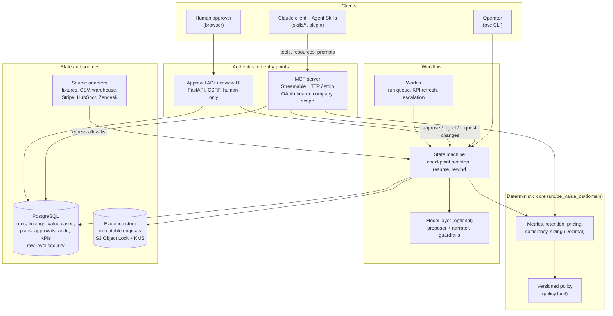
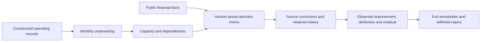
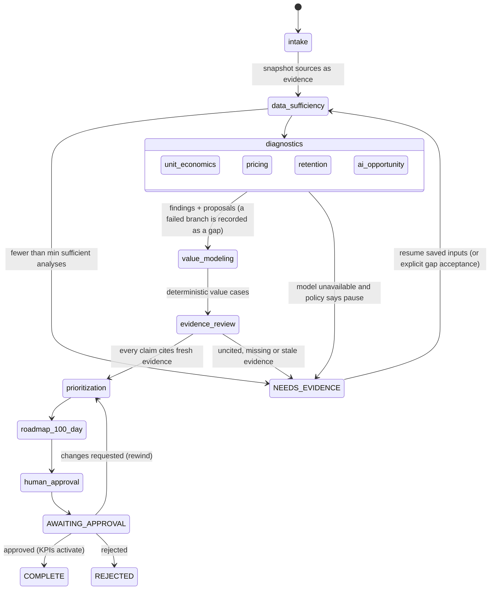

# Architecture

This document is for engineers joining the project and reviewers of its design. It covers the layers, how data moves through a diagnostic run, and where each guarantee is enforced. Decisions are recorded in [docs/adr/](adr/), and data shapes in [data_contracts.md](data_contracts.md).

## Layers

| Layer | Owns | Does not own |
|---|---|---|
| Deterministic core | All arithmetic (Decimal money, rates as fractions), metric definitions, sufficiency rules, value-case sizing (`CALC_VERSION`) | Judgment about which levers matter |
| Policy | Thresholds, freshness window, cost assumptions, prioritization weights; the version is stamped on every run | Code paths |
| MCP server | 22 typed tools, resources (`project://policies`, `company://{id}/data-inventory`, `run://{id}/summary`) and the review prompt. Scope is checked on every call. Arguments are strict: unknown fields are rejected. | Approvals: no tool can approve (ADR 0004) |
| Agent Skills | Domain procedure: diagnostic trees, checklists, output contracts | Numbers: skills call tools for every figure |
| Workflow | Step order, checkpoints, retries for transient errors only, timeouts, pause states | Business rules, which live in the core |
| Model layer | Opportunity proposals and plan narrative at judgment steps. Output is JSON-schema constrained and checked by the no-new-numbers guardrail. | Arithmetic and final sizing |
| Approval API | Human decisions, with diff, rationale and audit | Model access |
| PostgreSQL | System of record. Company isolation is enforced by row-level security on `pvc.companies`. | Evidence bytes |
| Evidence store | Immutable source snapshots, content-addressed ids | Derived analysis |

## Public research and the operating lifecycle

The diagram above describes the diagnostic application. The primary portfolio case also uses `src/pe_value_os/diligence`: an explicitly separate public financial fact base and constructed operating inputs produce reproducible CLI artifacts. Decimal calculations carry source identifiers, financial definitions, input hashes and immutable revision relationships into the executive memo.

Shared source pools are allocated explicitly so multiple initiatives cannot each claim the same baseline. Source corrections retain earlier decisions and costs; they can reverse an initially attractive plan. EBITDA, cash and equity sensitivities remain distinct. Published artifacts contain real public financial observations and labeled constructed operating examples, with no model or live database required to reproduce them. See the [case study](portfolio/case-study.md) and [diligence dispositions](research/operating-partner/09-public-diligence-disposition.md).

## Permissioned records and human finance review

The private workflow adds processing permission, source custody and finance acceptance before a financial snapshot can support underwriting. Capacity and a two-role baseline freeze precede reviewed counterfactuals, monthly observations, execution decisions and attribution proposals. These are company-scoped authenticated records, separate from public case generation and MCP model tools.

The [executive finance interface](pilot/permissioned/review-workspace.md) loads a packet under the company's repository lock and checks current source, baseline, execution and review dependencies. A distinct human finance reviewer accepts, rejects, requests changes or withdraws against exact proposal and review heads. CSRF-protected forms retain decision history; permission revocation removes current use while allowing the defined historical metadata and withdrawal paths. Repository transactions and forced PostgreSQL row-level security enforce company boundaries beneath the UI.

Tests and fictional browser captures establish these software behaviors. They do not establish an operating-company implementation, an independently validated normalized EBITDA figure or reconciled delivery costs. Remaining private workflow screens, cost reconciliation and operational acceptance belong to the later [permissioned pilot roadmap](portfolio/remaining-work.md). The [showcase acceptance register](portfolio/progress-acceptance.md) records the released scope and outstanding evidence.

## A diagnostic run

1. **Intake** loads the company's datasets through the configured adapter. Each dataset is stored as an evidence original with a deterministic id (`uuid5`), and its as-of date is recorded for the freshness metrics.
2. **Data sufficiency** decides which analyses the data supports. With too few, the run pauses at `NEEDS_EVIDENCE` and lists named gaps (dataset, file, row, field). Text that looks like prompt injection becomes a `suspicious_content` finding. It is never followed.
3. **Diagnostics** run four branches in parallel. A failure in one branch is recorded as a gap and the other branches continue.
4. **Value modeling** sizes each proposal with the deterministic calculator: low, base and high EBITDA, in-year and run-rate. Model output supplies scenario inputs only. Baselines always come from the server.
5. **Evidence review** checks that every opportunity and value claim cites evidence that exists and is within the freshness window. It also checks that no two opportunities size the same baseline. Any violation pauses the run at `NEEDS_EVIDENCE`. To use corrected source data, queue a new linked run with `pvc resume <run_id> --refresh-inputs --reason "<ticket>"`. Explicit gap acceptance uses `--accept-gaps` and is audited; it does not silently replace saved inputs.
6. **Prioritization** scores opportunities using the policy weights.
7. **Roadmap** builds workstreams, initiatives and KPIs for the 100-day plan. The model can write the narrative, but it cannot introduce numbers.
8. **Human approval** pauses the run. The approval API records the decision. The worker then resumes the run, and on approval activates KPI monitoring.

Every step writes a checkpoint and audit events. `pvc resume` re-runs the paused or failed step and skips completed ones using the immutable saved source and policy snapshots. `--refresh-inputs --reason "<ticket>"` queues a new linked run from current source/policy inputs; the old snapshots and approvals remain preserved. `--accept-gaps` is a recorded human decision to proceed despite data gaps. When the reviewer requests changes, the run rewinds to prioritization with a new review round; a decided approval is consumed once. The `pvc recompute` command re-sizes a run's opportunities with the current calculation version. It keeps the superseded value cases and reports what changed.

Workers claim available capacity and fence writes by current lease ownership. Losing the lease prevents stale writes. Notifications use a durable shared outbox claim and retries. Delivery is at least once: the receiver must deduplicate the stable idempotency key because delivery can succeed before the local success record is committed. Unchanged KPI content is deduplicated by persistent cadence/content state.

`/healthz` is process liveness and `/readyz` checks runtime dependencies on the API and MCP services. Target-environment readiness still requires deployed authenticated smoke tests.

## Where each guarantee is enforced

| Guarantee | Enforced by | Tested in |
|---|---|---|
| No model arithmetic | Sizing in `domain/services.py`; the no-new-numbers guardrail in `llm/guardrails.py` | `test_sizing`, `test_llm`, eval dimension `calculation_fidelity` |
| Evidence for every claim | `evidence_review` step; `extra=forbid` proposal contracts | `test_workflow`, eval dimension `evidence_fidelity` |
| Company isolation | `security.require` on every tool; PostgreSQL RLS with FORCE; scoped evidence paths | `test_auth`, `test_repository_contract` (Postgres), eval dimension `permission_fidelity` |
| Human-only approval | No approve tool. The API verifies tokens for its own audience and requires a human principal with the approver role, the `pvc.approve` scope and an allowed approval-UI client; CSRF protects forms | `test_api`, `test_mcp` |
| Least privilege for model clients | MCP tools that change state require `pvc.write`, and only on open interactive runs | `test_auth`, `test_mcp` |
| Reproducibility | Deterministic ids, versioned policy and calculator, snapshot tests | `test_snapshots`, `test_properties` |
| Controlled failure | Per-step timeouts, transient-only retries, pause states, fault injection. A timed-out attempt cannot write after a retry starts (repository guard, state copy) | `test_workflow`, `test_demo`, `test_audit_fixes`, eval dimension `recovery` |
| Outbound traffic | Checked HTTP clients enforce the application allow-list; SDK/telemetry transport exceptions use endpoint validation and network controls | `test_adapters`, `test_observability`, `test_security_remediation`; live network acceptance pending |

## Deployment

One container image runs every process: MCP server, approval API, worker, and the migrate and bootstrap tasks. The unvalidated target deployment is ECS Fargate behind an ALB, with RDS PostgreSQL and an S3 evidence bucket that uses Object Lock and KMS. The Terraform is in [infra/terraform/](../infra/terraform/), and the procedure is in [deployment.md](deployment.md). Logs, traces and metrics go through OpenTelemetry: each process installs OTLP export at startup when `OTEL_EXPORTER_OTLP_ENDPOINT` is set. Dashboards and alert rules are in [ops/observability/](../ops/observability/), and the SLOs are in [slo.md](slo.md).

### Outbound transport boundaries

Application `httpx` clients use the checked-client allow-list, including per-request redirect checks. Vendor pagination must retain the original authenticated origin. AWS boto3 and OpenTelemetry exporters use their SDK transports, so they do not inherit the common HTTP hook. AWS endpoint configuration, IAM/VPC endpoints, OTLP endpoint approval/TLS, and the Terraform egress firewall are separate controls and require staging verification. Identity-provider discovery/JWKS also needs its configured trusted host; do not infer complete network coverage from a passing common-client unit test.
