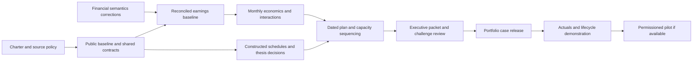

# Operating-partner capability roadmap

Prepared September 27, 2026 (America/New_York). Five research agents audited the
repository and consulted primary sources; the coordinator consolidated their
recommendations. Reviewed code: `8a6a540`; released application code: `31ebfe9`.
Implementation began September 28, 2026. The progress ledger below distinguishes
delivered increments from the remaining acceptance criteria.

## Implementation progress — September 28, 2026

The five-outcome goal remains active. No sponsor is available yet; Alex requested
the [permissioned pilot package](pilot/permissioned/README.md). Engineering,
public research and the constructed demonstration continue independently.

| Outcome / tickets | Delivered increment | Still required |
|---|---|---|
| Public Progress case / OP-01, 02, 09 | [Case charter](pilot/progress-case-charter.md), reviewed 10-K/Q1/Q2 mappings, 241 annual/interim facts, calculated quarter cash with source lineage, acquisition perimeter flag, ShareFile contribution/residual bridge, reconciled revenue mix, four sourced research assessments, metric-specific public peer eligibility with withheld strict medians and [public baseline](portfolio/progress-baseline.html) | Remaining organic/perimeter explanations where available, wider candidate/definition review and reviewed commercial conclusions |
| Earnings, cash and valuation / OP-04, 05–07 | Calculation v2 fingerprints EV assumptions; corrected contribution wording; annual/interim baseline measures with dependency-aware reconciliation; [24-month constructed underwriting](portfolio/underwriting.html) with dated EBITDA/cash, funding, scenarios, retained shared costs, combined price/churn and EV sensitivity; [historical company equity bridge](portfolio/historical-valuation.html) with 13 dated source facts and explicit claim assumptions | Independent review of the new adjustment register and unresolved comparative amortization; richer pool allocations/exclusivity; independent review of historical valuation assumptions and actual payoff inputs for any transaction |
| Capacity-aware plan / OP-03, 08, 10–11 | [Constructed 100-day proposal](portfolio/operating-plan.html): seven packages, four resource budgets, dependency/capacity constraints, conflict explanations and schedule-linked economics | Validated effort/capacity evidence and actual company participation; [constructed contract/service/invoice records](portfolio/operating-sources.html) now constrain a separate forecast; [constructed execution receipts](portfolio/execution.html) now separate assignment, delivery, acceptance and steering (ADR 0020) |
| Executive memo / OP-12–13 | [Integrated decision memo](portfolio/decision-memo.html): version-bound thesis/counterarguments, eight-entry adjustment register, three capacity-tested first waves, downside/cash/EV distinctions, embedded historical equity matrix and source appendix | Independent executive challenge, unresolved valuation diligence and final portfolio acceptance |
| Underwriting-to-realization and pilot / OP-14–17 | [Original/current revision walkthrough](portfolio/case-history.html), immutable PostgreSQL case snapshots, exact-version research reviews, review-bound hypothetical-close baselines (ADR 0018), [three-month constructed realization review](portfolio/realization.html) with append-only sources/claims and correction handling (ADR 0019), sponsor brief and pilot worksheets | [Constructed delivery-to-claim links](portfolio/execution.html), late-acceptance rejections and withdrawn-support history now available; richer operating evidence, lifecycle/learning and independently challenged attribution; actual sponsor, authorized records, intervention and outcome evidence for the pilot |

The [record-level source challenge](portfolio/operating-sources.html) now extends
OP-06/08/11 with authored contract, service/vendor and invoice records. Notice
deadlines, contract expiry, quality failures, vendor release dates, disputes and
missed payment windows change the forecast using the shared financial engine.
Its base first-year EBITDA is −18,314.50 and cash is −38,532.00; original inputs,
costs and frozen cases remain intact. This is an analytical alternative pending
review, not company evidence. See ADR 0021. The subsequent
[integrated case review](portfolio/source-review.html) persists the source challenge
and a vendor-evidence correction with simulated reviews (ADR 0022), retains the
latest 50% capture assumption, and preserves the frozen close and accounting
history. Its corrected year-one EBITDA is −163,165 and cash is −181,890.

OP-04's current screening corrections are implemented. OP-01 has a working
charter/source policy; OP-02/03/05–08/12 have partial foundations. The monthly
engine uses typed case drafts and persisted immutable revisions. Constructed assignment, steering, delivery and acceptance receipts are now persisted separately (ADR 0020); actual company activity remains unperformed. The scheduler supplies proposed dates and benefit availability to the shared engine (ADR 0012). Recorded work and gate review preserve those original plan dates and do not prove actual effort or causal value. Other tickets retain
their full acceptance criteria. A prepared pilot package is not a performed pilot,
and the annual baseline is not the completed public diligence case.

OP-16 now has a [real disclosure-vintage comparison](portfolio/disclosure-history.html):
18 acquisition-allocation facts from two annual filings, independently reconciled
and bound to issuer PDFs, plus cutoff selection that excludes later accepted
filings. Exact publication-time replay remains withheld: SEC acceptance does not
establish first public availability. The revision is a measurement-period
adjustment, so the accounting-error-restatement criterion also remains open.
See [ADR 0024](adr/0024-disclosure-vintages.md).

## Recommended destination

Build **one defensible investment and operating-review case**: a reviewer can
inspect the business, challenge a value-creation thesis, reconcile its economics,
choose a feasible first wave, and understand what evidence would establish an
actual result. Progress Software is the selected public reference company.
Neither its inclusion nor a simulated ownership timeline implies a client
relationship, a transaction, management endorsement or access to its operating
systems.

The current engineering showcase is closed under Alex's delegated decision;
see [the closeout and remaining validation limits](portfolio/showcase-closeout.md).
The next milestone is a stronger portfolio case, followed by a realization-method
demonstration and, only if useful and accessible, a real operating pilot.

Codex owns all research, data mapping, modeling, implementation, design, testing,
documentation and packaging below. Alex has authorized recommended defaults.
There is **no immediate questionnaire or technical setup assignment for Alex**.
Independent reviews and actual management decisions cannot be manufactured;
they are later evidence requirements for stronger claims, not prerequisites for
building an explicitly constructed demonstration.

## Decisions now fixed

| Topic | Recommendation adopted | Reason / boundary |
|---|---|---|
| Audience | PE operating partners and portfolio-company executives first; technical reviewers through drill-down evidence | Lead with decisions and economics; retain reproducibility and architecture proof |
| Case | Progress Software, with metric-specific peers and explicit exclusions | A coherent case is more useful than more fictional companies; its mixed licensing, channels and acquisitions require careful comparisons |
| Publication | Public Apache-2.0 code and independently sourced public-filing narrative | Vendor entitlements do not transfer through the code license |
| Data lanes | Public issuer facts; private licensed research; separately labeled constructed operating exercise | Public statements cannot substitute for customer contracts, tickets, headcount allocations or invoice aging |
| Client | Claude Code primary; Desktop/ChatGPT optional later compatibility checks | Installed six-skill plugin and stdio/HTTP connection checks pass; avoid maintaining three first-class client journeys now |
| Runtime | Keep existing local Docker stack and static public portfolio | No new cloud, Kubernetes, paid model dependency or platform rewrite is needed |
| Platform architecture | Add typed domain records to existing Pydantic/Decimal/PostgreSQL/Alembic code | Reuse tested scope, audit, workflow and evidence boundaries |
| Operating scope | Investigate three to five hypotheses; select at most three major concurrent workstreams in the constructed example | Selection can yield fewer or no actionable items. Three is a disclosed simulation default, not a staffing fact |
| Valuation | Show transparent multiple sensitivities only after defining the earnings measure | No investment recommendation, fair-value opinion or realized proceeds claim |
| User participation | Proceed with recommendations; request only newly necessary rights, inaccessible management facts, actual participation or bounded spending decisions | Routine engineering and methodological choices stay with Codex |

The [Progress FY2025 filing](https://investors.progress.com/static-files/2a74fac9-6513-42b2-b875-51cb2da6021c)
describes mixed revenue models and channels. Our inference is to avoid an
undifferentiated SaaS peer target and require a metric-level comparability rationale.
This is a research-design choice, not a conclusion about achievable savings.

## Initial audit: capabilities and gaps

This table preserves the initial research findings. The implementation ledger
above records subsequent corrections and additions against these gaps.

| Area | Already implemented | Material remaining gap |
|---|---|---|
| Financial sizing | Server-derived baselines, Decimal low/base/high, costs, optional EV multiple, timing and limited overlap checks | Monthly P&L/cash schedules, independent cost timing, full interactions, typed assumptions and complete valuation-input fingerprint |
| Evidence | Source IDs/hashes, supporting/contradicting evidence, data sufficiency and private statement reconciliation | Claim relevance, operating coverage, causal strength, source-class propagation and falsification gates |
| Benchmarking | Named peer context with date/currency checks; separate synthetic benchmark tool | Metric-specific eligibility, business-model/definition comparisons, exclusion sensitivity; no automatic opportunity from peer gap |
| Operating plan | Role owners, milestone text, governance cadence, ranked initiatives and approval edits | Named/proposed accountable operators, dated deliverables, enforceable dependencies, shared resource budgets and decision reasons |
| Monitoring | Run-specific KPI baselines, targets, observations, evidence and variance alerts | Reconciled financial actuals, counterfactual attribution, residuals and review state |
| Lifecycle | Run snapshots, linked refreshes, original/approved plans, receipts and historical KPIs | Frozen underwriting/close revisions, stable initiative lineage, original/current/actual comparisons and lessons |
| Executive experience | Professional memo, evidence disclosures, contribution views, decision forms and scorecards | A concise thesis/decision front page, reconciled earnings/cash/EV exhibits, assumption challenges and a complete operating-review narrative |
| Real-company study | Private Compustat research, four annual issuer bridges and four latest-quarter checks | Public-source implementation, segment/peer reasoning and real operating inputs if claiming actual interventions |
| LSEG | Attended session now works; exact-period revenue and GAAP operating-income sample matches issuer values | Reusable period/definition-aware normalization; sample does not certify all fields or peers |

Evidence for these findings is in the five linked reports below, including source
paths and actual symbols. The existing `complete` workflow status means the
diagnostic finished; it is not a realized-value status.

The initial financial audit found three concrete issues. Calculation v2 now
includes the separately supplied EV multiple in the input hash and describes
nonpositive annual contribution without claiming a cash-payback result. The
current screening phasing factor still scales net benefit and ongoing costs
together; independent cost timing remains OP-06 work. The v0.1.0 release retains
its original calculation version and does not contain these later corrections.

## Financial and evidence rules

Use three distinct exhibits. The EBITDA bridge reconciles an explicitly defined
baseline to incremental operating contribution and in-period implementation
expense. The cash bridge separately handles collection/payment timing, working
capital, capex and relevant cash costs. Count capex once and do not deduct
expensed implementation a second time when bridging EBITDA to cash. If tax,
working-capital or other required inputs are absent, label the result a defined
pre-tax/partial operating-cash proxy with omissions, not complete free cash flow.
The valuation view applies explicit
multiples to a consistently defined maintainable-earnings measure and separates
enterprise value from equity proceeds. Working-capital release is not EBITDA.
The [SEC's non-GAAP guidance](https://www.sec.gov/rules-regulations/staff-guidance/corporation-finance-interpretations/non-gaap-financial-measures)
supports clear measure definitions and reconciliations; adopting that discipline
does not represent this project as an issuer filing.

Keep improvement magnitude, captured share, evidence confidence and probability
of success as different inputs. Low/base/high cases are scenarios, not a
probability distribution. Use probability-weighted values only when the assumed
joint states and costs are explicit; label judgmental probabilities as assumed.
Do not multiply a realization haircut twice. Shared cohorts, retained shared
costs and mutually exclusive interventions must be resolved before adding totals.

Maintain separate decision, execution and measurement states. A human approval
does not prove execution; a completed milestone does not prove a KPI change; a
KPI change does not prove incremental financial impact. A realized-value claim
requires a dated baseline, appropriate actuals, reconciliation and an attribution
method with limitations. Monitoring and impact evaluation are different, as
explained in the [Magenta Book](https://www.gov.uk/government/publications/the-magenta-book/magenta-book-central-government-guidance-on-evaluation-html).

Retain observed facts, management representations, benchmark context, analyst
assumptions and constructed records as distinct classes. Constructed data never
becomes actual company evidence because it reconciles or passes a test. A public
export must check prose, charts, tooltips and embedded data as well as raw files.
The [IU use policy](https://libraries.indiana.edu/policies/e-resources-use) and
[WRDS policy](https://wrds-www.wharton.upenn.edu/pages/about/data-download-and-analysis-policy/)
are reasons to keep licensed research private and use independently sourced
issuer facts for the public case; dataset-specific rights still apply.

## Delivery sequence and stopping points

| Milestone | Deliverable | Completion evidence | Planning allowance |
|---|---|---|---|
| S0 — Existing showcase | Published `v0.1.0`, tested code and delegated closeout | Exact-build CI, seven verified release assets, Claude Code connection evidence; human/practitioner limits explicit | Complete for the revised showcase scope |
| S1 — Credible public diligence | Company charter, public baseline, definitions, peer rationale, evidence and hypotheses | Public-only reproducible memo using the existing renderer; no unsupported operating sizing | OP-01 through OP-05 plus allocated public parts of OP-09/12; approximately 11–15.5 focused days |
| S2 — Decision-ready operating exercise | Three driver templates, monthly economics, feasible 100-day plan, sensitivity/decision memo | All OP-01–13 acceptance criteria, including rejected/deferred/uneconomic challenge cases | Approximately 27.5–40 focused days total; reserve 30–45 with integration allowance |
| S3 — Underwriting-to-realization demonstration | Frozen original/revised cases, constructed actuals, variance attribution and lesson loop | OP-14–16; outcomes labeled constructed and actual company realization unavailable | Additional 9–15 focused days; external review time excluded |
| S4 — Permissioned company pilot | Bounded intervention using authorized operating/accounting evidence | Actual source reconciliation, management decisions, observed periods and review | Re-estimate after data discovery; operating/reporting time cannot be compressed by coding |
| S5 — Production | Target-environment acceptance, operations/security and separate launch | Original F11–F16/PVC production gates | Separate scope and budget, not part of this research phase |

These are estimates of focused engineering/research effort, not a promise about
agent runtime or calendar dates. Five research agents do not reduce the estimate
fivefold. Their individual estimates overlap substantially; the integrated tickets
below replace, rather than add to, those totals. S1 can ship while the operating
exercise is still being built. Do not wait for a private-company introduction to
finish S2.

S1 allocates 1–1.5 days of OP-09 to public peers/hypotheses and 0.5–1 day of
OP-12 to a thin memo using the existing renderer. It contains the public baseline,
peer eligibility, sourced observations and unanswered diligence questions only.
Financial opportunity exhibits wait for S2. Those allocations are included within
the OP-09/12 totals, not additional work charged again in S2.

## Consolidated implementation tickets

All tickets are owned by **Codex**, unless explicitly marked as a later external
dependency. Consult the implementation ledger above for partial and completed
work; the table retains each ticket's full scope. Effort includes meaningful
tests and documentation. Agent ticket mappings prevent duplicated work.

| Ticket / priority / effort | Codex actions and deliverable | Dependencies | Done when |
|---|---|---|---|
| **OP-01 Case charter and source policy** / P0 / 1 day | Fix entity, information cutoff, allowed claims, source classes, permitted output and method defaults; write decision register | None | Every source/output has a classification and destination; public replay needs no vendor account; no fictional client engagement or acquisition |
| **OP-02 Public issuer facts** / P0 / 3–4 days | Add a public-filing adapter and source fact registry; preserve accession/date, duration, units, currency, table/tag, extraction version and hash; document LSEG/WRDS cross-check metadata privately | OP-01 | Key annual/quarterly facts tie to issuer tables; YTD/discrete-quarter, custom tags, restatements and missing facts handled explicitly; no private extract in public artifacts |
| **OP-03 Shared case/evidence contracts** / P0 / 3–4 days | One ADR and typed case/revision/baseline/assumption/thesis/source-policy contracts; stable initiative IDs; additive persistence and dedicated case-review semantics | OP-01 | Immutable original revision; exact-revision review binding; model cannot approve; cross-company references and silent restatements rejected; current Beacon/Delta history preserved |
| **OP-04 Correct current financial semantics** / P0 / 0.5–1 day | Include EV assumptions in valuation provenance; replace invalid payback wording; define screening versus underwriting calculation versions | None; align names with OP-03 | Multiple changes alter EV outputs and valuation fingerprint while operating inputs/provenance, EBITDA and cash remain unchanged; nonpositive contribution is not mislabeled payback; screening numbers retain an explicit version |
| **OP-05 Reconciled earnings baseline** / P0 / 2–3 days | Build reported → standardized → modeled bridge and adjustment register; define EBITDA/adjusted EBITDA and accounting perimeter | OP-02–04 | Source facts and each adjustment traceable; no OIADP-to-EBITDA relabeling; R&D not counted twice; missing earnings components block dependent valuation |
| **OP-06 Monthly driver and cash model** / P0 / 3–5 days | Extend screening model with 24-month driver schedules for renewal pricing, service automation and collections; independent benefit/cost timing, expense/capex, recognition and cash timing | OP-03, OP-05 | Costs can precede or outlast benefits; zero adoption may lose money; cash/EBITDA remain separate; implementation/capex counted once; missing tax/WC inputs produce an explicitly partial proxy; monthly/day-100 totals reconcile; collections has zero EBITDA absent a separate supported effect |
| **OP-07 Interactions and sensitivities** / P0 / 2–3 days | Add benefit pools, exclusivity, allocation/shared-cost rules, scenario recomputation and optional valuation matrix | OP-06 | Overlapping initiatives cannot inflate total; exclusions retain unavoidable shared cost; delayed benefit preserves incurred cost; assumed probability not confused with confidence; multiple changes only valuation |
| **OP-08 Constructed operating case** / P0 / 2–3 days | Build deterministic, clearly marked schedules linked to declared public anchors; reuse CSV contracts; include contract, churn, cost and data-gap counterexamples | OP-02, OP-03, OP-05 | Generated records reconcile to their declared scope, not an invented segment P&L; no actual customer identities; classification survives ingestion, calculations and exports |
| **OP-09 Peer rationale and thesis decisions** / P0 / 2–3 days | Define metric-specific peer eligibility; investigate three to five hypotheses; record mechanism, counterevidence, falsification test and retain/reject/defer reasons | OP-02, OP-03; sized examples need OP-07/08 | Removing an unsuitable peer can change or suppress a benchmark; unsupported opportunity remains unsized; a negative result survives; no quota for positive findings |
| **OP-10 Dated execution and steering** / P0 / 2–3 days | Add proposed sponsor/operator, dated milestones, acceptance evidence, dependencies and steering decisions; maintain separate review/execution/value states | OP-03, OP-09 | One accountable operator per initiative; missing assignment visible; cycles/orphan prerequisites rejected; actual and simulated decisions cannot mix; original plan retained |
| **OP-11 Capacity-aware sequencing** / P0 / 2–3 days | Add weekly resource budgets/demand and a deterministic earliest-feasible schedule using a reviewer-authored order; feed dates to the shared financial engine | OP-06, OP-10 | Shared-resource conflict defers work with reason; enabler consumes capacity; unknown is not zero; no feasible slot stays blocked; timing change updates in-year forecast without rewriting original |
| **OP-12 Executive decision packet** / P0 / 3–4 days | Extend current UI with thesis/decision front page, separate earnings/cash/EV exhibits, selected/deferred work, evidence challenges, 100-day view and static export | OP-05–11 | Summary numbers reconcile to shared contracts; reviewer can trace one amount and challenge an assumption; technical details are discoverable; public/private/constructed origin unmistakable |
| **OP-13 Challenge review and portfolio release** / P0 / 2–3 days | Execute worked golden cases, adversarial finance/workflow checks, viewport/keyboard review and public-export audit; prepare concise case study, demo script and practitioner packet | OP-12 | All hard gates below pass; unresolved claims visible; clean allowed-source replay; current exact-build evidence; no suggestion of external validation that did not occur |
| **OP-14 Actuals and attribution ledger** / P1 / 3–5 days | Append-only period actuals and initiative allocations, locked-baseline comparison, costs and explicit residual; use constructed actuals initially | OP-03, OP-06/07 | Duplicate records do not create benefit; corrections preserve history; favorable residual remains unassigned; source reconciliation and attribution confidence separate |
| **OP-15 Full lifecycle and learning exercise** / P1 / 4–6 days | Connect original underwriting, hypothetical close revision, ownership reviews and exit scenario; review receipts, KPI lineage, lessons and export/retention handling | OP-10, OP-14 | Original/current/actual comparable by period/basis; split initiatives retain lineage; exit scenario cannot become proceeds; lesson records preserve what was known then versus learned later |
| **OP-16 Narrow historical replay** / P1 / 2–4 days | Replay one public filing snapshot with actual publication time; compare a later restatement without overwriting the earlier information set | OP-02/03, OP-15 | Later information excluded at earlier cutoff; unavailable timestamp blocks point-in-time claim; current-vintage vendor cache remains correctly labeled |
| **OP-17 Real pilot** / later / estimate after source discovery | Prepare minimal data request, map authorized sources, reconcile finance, design a contained intervention and counterfactual, collect observations, revise from review | Sponsor/data/management participation; S2 and relevant S3 controls | Actual decision and operating evidence exist; no simulation substituted; finance reconciliation and attribution limits documented; outcome may be negative or inconclusive |
| **OP-18 Production decision** / later / separate estimate | Execute applicable existing staging, identity, recovery, load, security, policy, monitoring and launch plan | OP-17 plus approved costs/owners/targets | Original production acceptance criteria met; separate launch decision recorded |

The renewal, automation and collections templates demonstrate distinct economics;
they are candidate mechanisms, not current recommendations for Progress. A
collections case is intentionally useful for proving that cash release does not
inflate EBITDA. A foundation can consume cost and capacity while having no direct
benefit. If the source evidence rejects a mechanism, preserve that conclusion.

## Dependencies and integration ownership

The coordinator owns a single shared contract design. Do not build separate
baseline stores, assumption models or phasing calculators in each workstream.
Source and financial definitions lead UI work. Scheduling supplies dates to the
financial engine; the engine owns financial totals. Case review must have its
own service because the existing plan approval path activates KPIs. Keep schema
migrations additive and exercise them on disposable populated databases before
changing the user's persisted showcase.

| Integrated scope | Agent tickets absorbed |
|---|---|
| OP-01–03 | CE-01/02/04, LC-01/02, shared portions of FIN-01/02 and OM-02 |
| OP-04–07 | FIN-01–06, financial baseline parts of LC-01/03 |
| OP-08/09 | CE-03/05/06, OM-01, case content from LC-04 |
| OP-10/11 | OM-02–05, LC-03/06 execution integration |
| OP-12/13 | Executive report's showcase tickets, FIN-07, CE-07/08, OM-06, LC-04 export |
| OP-14–16 | FIN-08/09, LC-05–09; narrow exit scenario only |
| Later/deferred | OM-07, FIN-10/11 where justified, existing production roadmap |

## Acceptance that matters

S2 must pass each hard gate. These checks extend the existing test infrastructure;
test count is not the objective.

1. **Public case reproducibility:** rebuild the memo from allowed public inputs;
   no vendor credentials, licensed rows or private report needed. Missing public
   facts remain missing. A permitted source snapshot or its exact identity and
   extraction lineage is retained.
2. **Source truth:** every material claim is a sourced fact, explicitly assumed
   inference or constructed scenario. A deliberately unsupported high-value
   hypothesis stays unsized or blocked. Contradictory evidence changes disposition.
3. **Financial reconciliation:** hand-worked golden cases verify period totals,
   units, cost timing, overlap and sensitivity; EBITDA, cash and EV never share an
   invalid total. An adverse case remains adverse.
4. **Feasible plan:** a shared-owner conflict forces a delay, a removed prerequisite
   blocks dependent work, and the same schedule changes the financial forecast.
   The scheduler claims feasibility, not mathematical optimality.
5. **Version and authority:** editing an assumption creates a reviewable revision;
   original figures and receipts stay intact. Models cannot approve real plans or
   finance claims. Simulated decisions never appear as actual management acts.
6. **Executive challenge:** a reviewer can explain the thesis, why the first wave
   was selected, which assumptions dominate, what would invalidate it and what
   decision is due next. Changes in assumptions produce consistent outputs.
7. **Usability and publication:** keyboard/narrow-screen checks and export review
   cover new decision surfaces; source classifications remain visible in screenshots
   and static output. Code is Apache-2.0; source data rights remain distinct.
8. **Honest result:** the final case labels practitioner review and real company
   outcomes as absent unless actually obtained. Software acceptance cannot promote
   a simulation to a business result.

Use the [executive validation report](research/operating-partner/05-executive-validation.md)
for the detailed review rubric. Codex can execute engineering and structured
challenge reviews; label their authorship. An independent practitioner is useful
for credibility but is never impersonated or silently substituted by another agent.

## Your actions versus mine

| Stage | Codex responsibility | Alex's necessary involvement |
|---|---|---|
| Now through S2 | All routine recommendations, source work, code, financial model, constructed schedules, UI, tests, documentation and release preparation | None required now; optional corrections to business interests or narrative |
| Attended LSEG use | Small scoped requests, metadata inspection, reconciliation and private storage; no authentication retries or source-project modifications | Keep an entitled session available when needed; tell us if permitted use changes |
| Institutional rights question, if encountered | Identify the exact proposed use and prepare a concise question; continue public-source work independently | Obtain a determination from the institution/vendor if only the account holder can do so |
| Independent practitioner review, when desired | Prepare short memo, calculation worksheet, challenge prompts and feedback log; implement corrections | Introduce a willing reviewer or provide an existing contact. No message is sent without authorization |
| Actual operating pilot | Prepare source requests, minimization/mapping, reconciliation, intervention plan and reporting | Introduce an authorized sponsor/data owner; actual managers supply decisions, capacity and operational facts |
| Paid/cloud/production scope | Prepare specific architecture, costs, risks, teardown and acceptance work | Authorize bounded spending and identify accountable operating/launch owners |

Already supplied: code publication rights and Apache-2.0 choice, GitHub/Docker
environment, university data context, access to local research caches, attended
LSEG session and Claude Code preference. Do not ask for these again. Passwords
and keys remain in local ignored configuration; none belongs in a public roadmap.

## What we deliberately defer

Defer general ERP/project-management features, a universal LBO/fund-accounting
model, broad vendor integrations, more synthetic companies, automated email or
calendar actions, a complex optimization engine, calibrated probabilities without
outcome data, live-model prose as a substitute for analysis, and production
infrastructure work unrelated to the portfolio finish line.

The eventual resume/case-study claim should describe the delivered method and
verification: built an evidence-linked PE decision workflow with deterministic
financial scenarios, constrained planning and an auditable baseline-to-actuals
method. Add actual adoption or realized impact only after it is supported.

## Five research reports

1. [Commercial thesis and evidence](research/operating-partner/01-commercial-evidence.md)
   — primary issuer evidence, peers, provenance, causal relevance and falsification.
2. [Financial rigor and realization](research/operating-partner/02-financial-realization.md)
   — audited engine, monthly P&L/cash, interactions, sensitivities and attribution.
3. [Operating method](research/operating-partner/03-operating-method.md)
   — selection, capacity, accountable execution and steering decisions.
4. [Lifecycle and architecture](research/operating-partner/04-lifecycle-architecture.md)
   — immutable baselines, actuals, review boundaries and institutional learning.
5. [Executive experience and validation](research/operating-partner/05-executive-validation.md)
   — memo exhibits, challenge rubric and truthful public proof.

Each report distinguishes researched recommendations from implemented behavior,
lists repository references, cites primary sources and proposes acceptance tests.
The consolidated tickets above govern implementation order and effort; retain
the reports as the reasoning behind those decisions.

## Source-backed revision increment — September 28, 2026

Implemented the [integrated case review](portfolio/source-review.html): exact
source books, prior-assumption lessons and simulated reviews now persist in the
existing case ledger. A correction removes unsupported vendor release evidence
while retaining the latest capture assumption. The source challenge and adverse
correction change the current forecast, preserving the original, frozen close,
five constructed accounting periods, claims and residuals. Existing v1 signed
records remain readable without hash changes; no live database migration is needed.
See [ADR 0022](adr/0022-source-backed-case-revisions.md).

Codex next owns initiative/KPI lineage, exit-value boundaries, publication-vintage
replay and the final executive/practitioner acceptance packet. Real pilot work
still requires a sponsor, authorization, a tested private-data lane and actual
management participation. Alex has no sponsor yet and requested the
[prepared pilot package](pilot/permissioned/README.md); preparation and simulation
do not count as a company pilot or realized results.

## Executive consistency increment — September 28, 2026

The [executive memo](portfolio/decision-memo.html) now consumes the exact saved
source-review context and reopens its original service-first preference. Every
registered sequence is recomputed with current source rows, assumptions and
capacity; the previous conditional preference is retained as historical reasoning.
The revised earnings waterfall reconciles to the shared ledger, while historical
company valuation remains separate from fictional operating changes. This closes
the contradiction between the original memo and the subsequent adverse source
review (ADR 0023). It does not establish management approval or pilot results.
