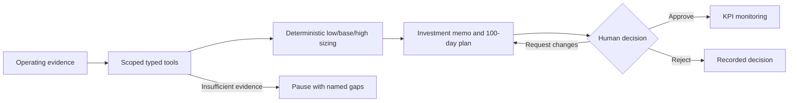

# From an investment hypothesis to an executable value-creation plan

**Value Creation OS** is an operating partner workspace for reviewing a portfolio company's opportunities, challenging the financial case and authorizing a 100-day plan. Its executive surface is backed by inspectable engineering: evidence provenance, deterministic calculations, durable workflows and explicit human authority.

The primary audience is **PE operating partners, investment professionals and portfolio-company executives**. Technical hiring managers, applied-AI leaders and implementation teams can follow the same case into its architecture, contracts and verification evidence.

[Portfolio overview](examples/workspace.html) | [Investment memo](examples/beacon-pricing.html) | [Execution KPIs](examples/beacon-kpis.html) | [Run the workspace](quickstart.md) | [Architecture](../architecture.md) | [Acceptance record](acceptance.md)

## The operating question

Where should the management team act, what is the value at stake, and what must be true for that value to materialize?

A useful answer connects fragmented billing, financial, customer and support records to a small set of accountable workstreams. The reviewer needs a clear base case and downside, the assumptions driving each opportunity, any evidence gaps, the owner of execution, and the decision required. A plausible recommendation by itself does not satisfy that review.

Value Creation OS organizes the journey around those questions. The portfolio overview surfaces company status and decision needs. The investment memo brings the value thesis, financial sizing and workstream ownership together. Supporting evidence and technical calculation detail remain accessible. Human decisions govern which initiatives proceed to monitoring.

## Beacon: a concrete, synthetic investment case

Beacon Scheduling Systems is fictional. Its scenario produces a modeled base-case annual run-rate EBITDA opportunity of **1,148,309**, with **739,200** modeled in-year impact across **three workstreams and five initiatives**. These are outputs in the fixture's financial units, not realized savings, audited forecasts or customer results.

| Initiative | Modeled base annual run-rate EBITDA | Executive question |
|---|---:|---|
| Migrate legacy price-book customers | 380,650 | Which customers can move, under what notice periods and caps? |
| Enforce contracted renewal uplifts | 351,942 | Why are contracted uplifts not being realized? |
| Discount governance in mid-market | 215,006 | How much discount leakage is addressable without impairing conversion? |
| Improve sales and marketing efficiency | 191,160 | What efficiency is plausible given the current acquisition economics? |
| Deflect tier-1 support with AI self-service | 9,552 | Does automation remain attractive after implementation and operating cost? |

Initiative values are rounded for this narrative; the aggregate is computed from the underlying deterministic amounts. Pricing opportunities dominate this scenario. The support automation case remains modest and uncertain: **-31,020 low / 9,552 base / 61,716 high**. The downside is visible rather than discarded. Its calculator version is `value-case/1`; two evidence items support that case. Pricing cases retain six evidence items each. The [generated scenario report](demo-report.md) supplies the reproducible context.

This creates an executive discussion, rather than a blanket recommendation to deploy AI. Contract review precedes customer communication, operating-model changes require their own review, and unquantified candidates remain explicitly unsized.

## The review and decision journey

1. **Diagnose.** Review the company's operating evidence and the sufficiency of the fact base.
2. **Underwrite.** Challenge the baseline, improvement, realization, flow-through, cost and timing assumptions in the investment memo. Follow the evidence links before accepting a number.
3. **Decide.** Approve the scoped plan, request changes with a rationale, or reject. The system records the decision separately from any model output.
4. **Monitor.** Inspect approved KPI definitions and observations in the context of the relevant run. A definition or seeded observation is not evidence of realized business performance.

Alex has completed local browser sign-in and a Beacon approval. The worker's completion and resulting KPI records were separately verified. Remaining client, evidence-review and usability acceptance are tracked in [the acceptance record](acceptance.md); this case study does not imply that every human session gate has passed.

Delta is the counterexample. Only one of four analyses has sufficient evidence, while policy requires two. Missing financial months, stale invoices and incomplete contracts produce a named `needs_evidence` pause. Planted instruction text produces suspicious-content findings. A separate Cedar fault injection demonstrates partial failure and retry without re-executing completed steps.

## Technical diligence behind the memo

| Engineering decision | Operating implication | Implementation evidence |
|---|---|---|
| Deterministic financial core | A reviewer can reproduce the same assumptions and amounts | Domain calculators, policy snapshots, versioned value cases |
| Server-issued quantity references | Model prose must use a fact with a valid company, unit, period and evidence reference | Proposer/narrator validation and quantity registry |
| Typed MCP contracts | Client and agent behavior have inspectable interfaces | Tool schemas and procedural skills |
| Separate human approval authority | A model or ordinary MCP credential cannot authorize a plan | Separate API audience, human role/scope checks and audited decisions |
| Durable checkpoints and leases | A worker interruption preserves the business record | PostgreSQL state, claims, idempotency and resume |
| Company isolation and immutable evidence | Access and provenance are enforced beyond the prompt | Repository checks, PostgreSQL row-level security and evidence storage |
| Artifact-specific release gates | Published packages and images must match verified artifacts | Installed-package, evaluation, Compose and scan evidence |

The default showcase uses rules and synthetic data, so reviewers need no provider key. Optional model components propose opportunities and narrative; typed tools retain ownership of facts and calculations. Source integration paths exist for warehouse/CSV/HubSpot/Zendesk, but no real-pilot reconciliation is claimed.

## Verification and boundaries

Use [the versioned evidence index](../releases/0.1.0/evidence.md) for exact reviewed commits, test counts, evaluation outcomes, package checks, live Compose journeys and application/database scans. These links distinguish verified historical builds from changes still undergoing review. [Load-test methodology](../load_test.md) separates local synthetic measurements from staging SLO acceptance. [The recording storyboard](../pilot/demo-script.md) follows the actual operating journey and labels scripted versus human evidence.

The interface is server-rendered HTML with no third-party frontend assets. PostgreSQL and immutable evidence retain the system of record. AWS Terraform describes a future deployment; a local showcase does not establish AWS, production browser OIDC, customer readiness or on-call acceptance. Optional observability images have their own disclosed scan findings.

The project uses AI-assisted implementation and audit workflows. Its claim is an inspectable implementation with reproducible evidence, not independent human certification. Approved policy and benchmarks, real-source reconciliation, domain/security/legal review, recovery and SLO evidence, staffed operations and pilot/launch decisions remain in the [production roadmap](../portfolio-finalization-roadmap.md).
