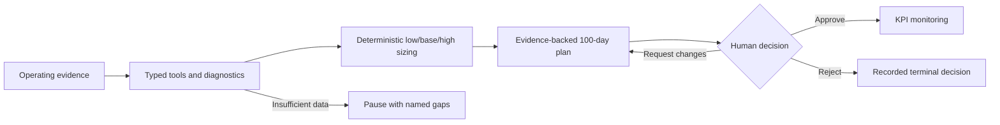

# Governed AI workflows for portfolio-company operations

**PE Value Creation OS** turns operating evidence into deterministic value cases and a human-reviewed 100-day plan. It is a Python/MCP portfolio project for evaluating applied-AI architecture, financial modeling controls, durable workflows and operational engineering.

[Run the showcase](quickstart.md) · [Actual synthetic output](demo-report.md) · [Architecture](../architecture.md) · [Acceptance evidence](acceptance.md)

## The problem

A portfolio operator needs to connect fragmented billing, financial, customer and support evidence to a defensible action plan. A plausible AI recommendation is insufficient: the reviewer needs to know where each number came from, what assumptions drive the case, what data is missing and who approved the next step.

The project makes these boundaries explicit. Typed tools retrieve evidence and compute financial metrics. Optional model components propose opportunities and narrative. Deterministic code sizes each value case and validates numeric references. A durable workflow pauses for missing evidence or a human decision, then tracks approved KPIs.

## One concrete example

In the fictional Beacon scenario, the application identifies discount governance, renewal uplifts and legacy price-book migration alongside smaller support/sales levers. The [generated report](demo-report.md) shows a total modeled base-case annual run-rate EBITDA opportunity of **1,148,309**, with **739,200** modeled in-year impact across three workstreams. These are synthetic scenario outputs, not realized savings, audited forecasts or customer results.

The support self-service case is deliberately less attractive: **−31,020 low / 9,552 base / 61,716 high**. Keeping the negative case visible demonstrates that the workflow does not silently turn every AI suggestion into a positive investment case. Its calculator version is `value-case/1`; two evidence items support that case. Pricing cases retain six evidence items each.

The run stops at `awaiting_approval`. An unauthenticated decision receives HTTP 401. The scripted demonstration uses an explicit human-principal test token, records the decision, resumes the worker and activates five KPIs. This proves the automated path; an actual person's client and browser acceptance is recorded separately and remains pending.

Delta provides the counterexample: only one of four analyses has sufficient data, while policy requires two. Missing financial months, stale invoices and missing contracts produce a named `needs_evidence` pause. Planted instruction text produces suspicious-content findings. A separate Cedar fault injection demonstrates partial failure and retry without re-executing completed steps.

## Engineering decisions a reviewer can inspect

| Decision | Why it matters | Implementation |
|---|---|---|
| Deterministic financial core | Numeric results remain reproducible and versioned | Domain calculators, policy snapshots, value cases |
| Server-issued quantity references | Model prose cannot invent a number or transplant another company's fact | Model proposer/narrator validation and quantity registry |
| Typed MCP surface | Client behavior is governed by explicit tool contracts | 22 tools, schema snapshots, six procedural skills |
| Independent human approval | A model or MCP credential cannot authorize a plan | Separate API audience, human role/scope checks, audited decisions |
| Durable checkpoints and leases | Worker interruption does not discard the business record | PostgreSQL state, worker claims, idempotency and resume |
| Company isolation and immutable evidence | Tenant access and provenance are enforced below the prompt layer | Repository checks, PostgreSQL RLS, evidence storage |
| Strict release gates | A successful import or historical green build is insufficient | Installed-demo/eval smoke, container scans, exact-SHA promotion |

## Validation and tradeoffs

The [verified main build at `fd00495`](https://github.com/ahines99/pe-value-creation-os/actions/runs/36359511827) passed all ten CI jobs: 453 tests on each of Python 3.12, 3.13 and 3.14; 39/39 deterministic evaluation cases; installed-package and Compose journeys; infrastructure checks; secret/dependency checks; and strict application/database image scans. The Linux matrix exercised the symlink coverage that Windows could not run without additional privileges. See [the evidence index](../releases/0.1.0/evidence.md) for scope and [human acceptance](acceptance.md) for the remaining independent session.

[Load-test methodology and results](../load_test.md) distinguish local synthetic measurements from staging SLO acceptance. [The recording storyboard](../pilot/demo-script.md) follows evidence, sizing, human decision, KPI activation and the controlled missing-data case; rendered screenshots and the actual human session remain pending.

The default demo uses rules and synthetic data so reviewers need neither credentials nor paid inference. That makes the core behavior repeatable, while the current optional live-model path still needs a newly authorized provider evaluation. The source has warehouse/CSV/HubSpot/Zendesk integration paths; no real pilot reconciliation is claimed.

Server-rendered HTML keeps the review surface small. PostgreSQL and immutable evidence provide an inspectable system of record. AWS Terraform describes a later deployment, but the local showcase does not prove AWS, browser OIDC, customer readiness or on-call operations.

## What this project demonstrates

The strongest evidence is the connection between behavior and verification: a missing fixture in installed wheels was reproduced and fixed; grounded numeric contracts gained adversarial coverage; a vulnerable base image was replaced and checked against real workloads; deployment promotion now verifies the scanned artifact; and the reviewer can follow a plan back to its evidence.

The project uses AI-assisted implementation and audit workflows. It presents inspectable code and evidence, without claiming that agent-authored checks are independent human review. Production still requires approved policy/benchmarks, real-source reconciliation, security/legal review, recovery and SLO evidence, staffed operations and pilot/launch decisions. Those obligations remain in the [production roadmap](../portfolio-finalization-roadmap.md).
